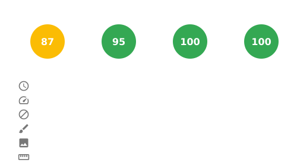

# Tarjeta de Métricas del Sitio
<!--

-->

[](https://snyk.io/test/github/aelmizeb/site-metrics-card)

[](LICENSE)

**Muestra las métricas de rendimiento de tu sitio web en tu README de GitHub.**  
Una herramienta ligera enfocada exclusivamente en analizar y visualizar el rendimiento de sitios web, incrustable en cualquier lugar, ¡incluido el README de tu perfil de GitHub! Admite sitios web personales, organizaciones e incluso repositorios.



## 🚀 Características

- Analiza cualquier sitio web público
- Mide los Core Web Vitals utilizando Lighthouse
- Genera una tarjeta SVG incrustable con puntajes de rendimiento
- Automatiza la generación con GitHub Actions / GitLab CI
- Fácil de integrar en tu README

## 📦 Uso

1. **Instala las dependencias:**

   ```bash
   npm install
   ```

2. **Ejecutar localmente**:
   ```bash
   URL=https://www.wikipedia.org npm start
   ```

3. **O generarla diariamente usando GitHub Actions**

- Clona el repositorio.
- Edita la URL en `.github/workflows/generate-card.yaml`:

   ```bash
  env:
  URL: 'https://www.wikipedia.org'
   ```
- Asegúrate de que GitHub Actions tenga permiso para leer y escribir en tu repositorio.

4. **O generarla diariamente usando GitLab CI**

- Clona el repositorio.
- Edita la URL en `.gitlab-ci.yaml`:

 ```bash
  variables:
    URL: 'https://www.wikipedia.org'
    THEME: 'transparent'  # Can be overridden to "dark" or "transparent"
 ```
- Crea un Token de Acceso Personal (PAT) en GitLab
  - Ve a tu perfil de GitLab → Preferencias → Tokens de Acceso
  - Crea un token con los siguientes ámbitos (scopes): api, write_repository
  - Copia el token, no podrás verlo nuevamente.

- Agrégalo como una variable secreta de GitLab CI/CD
  - Ve a tu proyecto → Configuración → CI/CD → Variables.
  - Añade una nueva variable:
    - Clave: CI_PUSH_TOKEN
    - Valor: (pega tu PAT aquí)
    - Ámbito: Todos los entornos (predeterminado)

- Añade un Pipeline Programado en GitLab:
  - Ve a tu proyecto → Build → Programación de Pipelines
  - Haz clic en "Crear una nueva programación de pipeline"
  - Establece la descripción, zona horaria e intervalo: 0 0 * * *
  - Guárdalo

## 💡 Ejemplo

```md

```

## 🛠️ Stack Tecnológico

- Node.js
- Puppeteer + Lighthouse
- node-canvas
- TypeScript
- GitHub Actions
- GitLab CI

## 📄 Licencia
MIT
