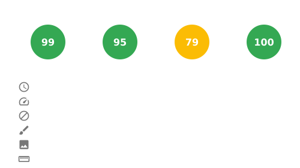

# Site Metrics Card


[](https://snyk.io/test/github/aelmizeb/site-metrics-card)

[](LICENSE)

**Display your website's performance metrics in your GitHub README.**  
A lightweight tool focused solely on analyzing and visualizing website performance, embeddable anywhere—including your GitHub profile README! Supports personal websites, organizations, and even repositories.



## 🚀 Features

- Analyze any public website
- Measure Core Web Vitals using Lighthouse
- Generate an embeddable SVG card with performance scores
- Automate generation with GitHub Actions
- Simple to integrate into your README

## 📦 Usage

1. **Install dependencies:**

   ```bash
   npm install
   ```

2. **Run locally**:
   ```bash
   URL=https://www.wikipedia.org npm start
   ```

3. **Or generate it daily using GitHub Actions**

- Clone the repo.
- Edit the URL in .github/workflows/generate-card.yaml:

   ```bash
  env:
  URL: 'https://www.wikipedia.org'
   ```
- Ensure GitHub Actions has permission to read and write to your repository.

## 💡 Example

```md

```

## 🛠️ Tech Stack

- Node.js
- Puppeteer + Lighthouse
- node-canvas
- TypeScript
- GitHub Actions

## 📄 License
MIT